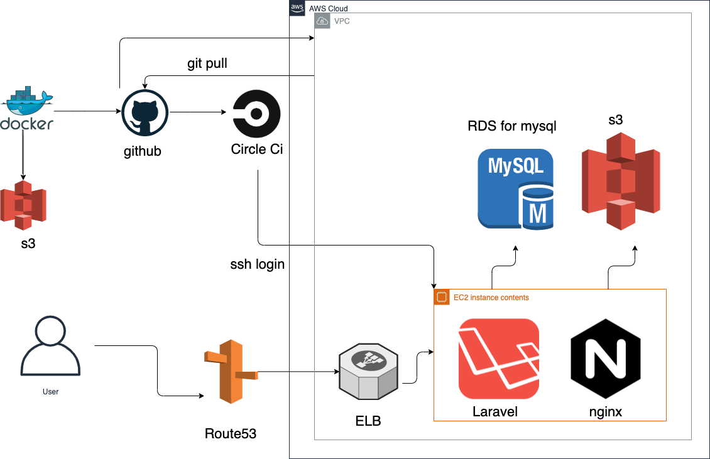

# sharety
## URL
アプリURL:https://www.sharety2.com/
 
テストユーザー 
メールアドレス:test@icloud.com 
パスワード:test1234
## 概要
不用品を引き取り転売をし、ビジネスを成り立たせている人たちがいます。0円でもいいから邪魔な物を引き取って欲しいと思っている人たちがいます。 
売ることを前提としないプラットフォームが必要だと思います。 
Sharetyは、あなたが必要ないもしくは現在使う機会がないものを近場で共有もしくは他人へ譲ることができるアプリケーションです。
##  技術一覧
- バックエンド
    - PHP 7.4.11
    - Laravel 6.20.5
    - MySQL 8.0.22
- フロントエンド
    - html
    - css
    - Javascript
    - jQuery
    - Bootstrap
- Web API
    - Pusher(リアルタイム通信)
- インフラストラクチャー
    - ローカル開発環境/本番環境
        - Docker  19.03.13
        - docker-compose 1.27.4
    - AWS
        - VPC
        - EC2
        - RDS
        - ELB
        - Route53
        - S3
        - Nginx
## アプリケーション構成図

## 機能
- ユーザー登録、ログイン
- ユーザープロフィール画像登録
- ユーザープロフィール変更機能
- CRUD機能(投稿に関する)
- 画像複数投稿機能(s3)
- 商品検索機能
- リアルチャット機能(ajax,pusher)
- メッセージメール通知機能
- 既読・未読機能
- 未読数表示
- 商品ページネーション機能
- 非同期いいね機能(ajax)
- いいね数表示
- いいねした投稿を表示する
- レスポンシブデザイン対応

